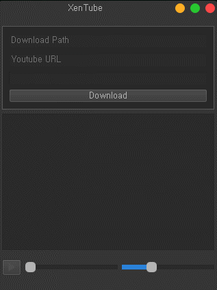
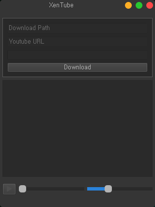
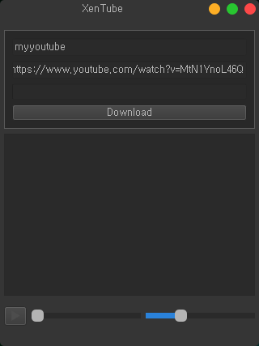
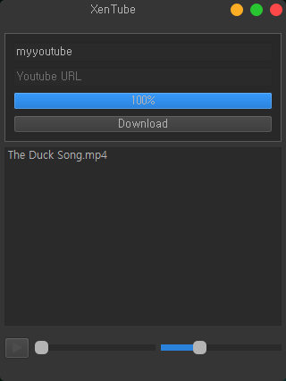
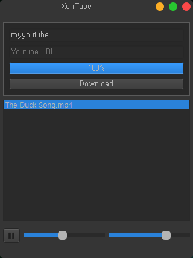

# XenTube

    

XenTube that downloads, plays, and collects YouTube videos.

## Example

    
    
    
    

## Installation

**[Important]** Download and install Codecs first ❗

-   [Codecs] : `K-Lite_Codec_Pack_1568_Standard.exe`
    -   [Web](http://downloads.ddigest-dl.com/software/download.php?sid=1089&ssid=0&did=375) or `K-Lite_Codec_Pack_1568_Standard` files in `Codecs` folder

## Execution / Test Environment

-   Windows 10
-   Python 3.6
-   PyQt5

## References

https://doc.qt.io/qtforpython/

https://github.com/gmarull/qtmodern
